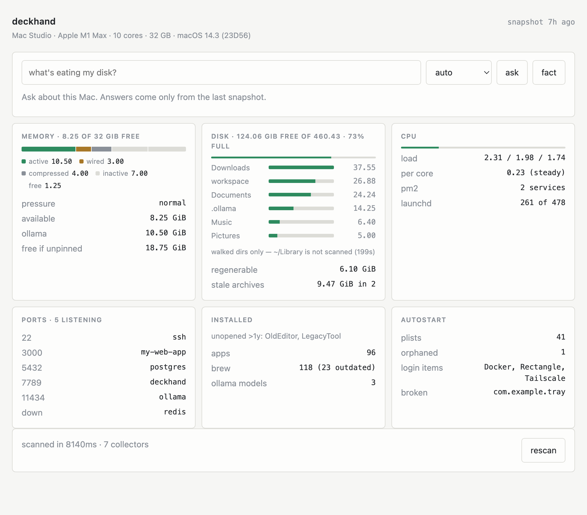

# deckhand

A deckhand who knows every inch of this Mac — what's on it, what's running, what
the specs are. Read-only: it observes and explains, it never deletes, kills, or
reconfigures. Cleanup ideas come out as a command for you to run, not an action.



*(Screenshot rendered from `fixtures/demo-snapshot.json` — synthetic data, so no
real machine inventory ships in this repo.)*

**Phases 1 and 2 are done.** Seven collectors snapshot the machine into
`data/snapshot.json` in about 8 seconds with no AI involved; `ask` and `fact`
then read that file. Phases 3–4 (history, `suggest`) build on the same seam —
see `PLAN.md`.

## Use it

```sh
node deckhand.mjs scan     # snapshot the machine → data/snapshot.json
node deckhand.mjs show     # human summary of the last snapshot
node deckhand.mjs serve    # web UI on http://localhost:7789

node deckhand.mjs ask "what's eating my disk?"
node deckhand.mjs fact     # one non-obvious observation
node deckhand.mjs providers
```

No install, no dependencies, no build step. Node 22+, macOS.

## The UI

`serve` puts a page on **7789** (`DECKHAND_PORT` to change it). It binds all
interfaces so it's reachable over Tailscale from a phone — set
`DECKHAND_HOST=127.0.0.1` for loopback only.

It is not just a chat box. The page renders the snapshot as six cards — memory
(with a true vm_stat composition bar), disk (top directories as ranked bars),
cpu, ports, installed, autostart — plus an ask box and a rescan button. Styling
low-key, no glow, thin uniform cards; it works on a phone.

## Asking it things

One model answers everything. Order is `ollama → gemini → claude`, and
everything after the first is **failover for when a provider is down**, not a
second opinion on hard questions. An earlier version routed arithmetic to a
bigger model; that turned out to be papering over a bug in the digest, and
routing around a bad prompt would have hidden it forever.

| | context | cost |
|---|---|---|
| `ollama` qwen2.5-coder:14b | 16k, routed digest (~1–3k tok) | free, offline |
| `gemini` 2.5-flash | 1M, digest **+ the raw snapshot** | free tier |
| `claude` haiku via CLI | digest only | **billed** — ~$0.03/question |

Shrinking the snapshot is a qwen constraint, not a universal one, so each
provider gets a prompt sized for it. Claude gets the digest rather than the raw
snapshot because attaching it cost $0.32 a question against $0.034 for the same
answer.

Every answer is checked on the way out: figures must appear in the facts or
follow from them, and comparisons between quantities are verified. Anything that
doesn't hold up is flagged under the answer rather than silently trusted.

## What it collects

| Collector | ~Time | What you get |
|---|---|---|
| `hardware` | cached | chip, core split, GPU, displays, storage, OS build |
| `memory` | 80 ms | unified-memory headroom, pressure, swap, RSS hogs, Ollama residency |
| `processes` | 250 ms | load average per core, busiest processes, pm2, launchd |
| `network` | 120 ms | listening ports merged from lsof + netstat, tailscale, port registry |
| `installed` | 1.3 s | apps + last-opened dates, brew, npm globals, ollama models |
| `autostart` | 190 ms | LaunchAgents/Daemons, orphans, failing jobs, login items, pm2 hook |
| `disk` | 7.5 s | the volume that actually fills up, directory sizes, big files, cleanup candidates |

Collectors run concurrently and never throw: a source that fails records *why*
in the snapshot and the rest still writes. `disk` is ~99% of the wall clock.

## Tips

**`df -h /` is lying to you.** It reports the sealed system snapshot — 21% used
here. The volume that fills up is `/System/Volumes/Data`, at 88%. `show` leads
with the real one.

**Not every "unopened in a year" app is really unopened.** Only about half the
apps on this Mac have a real `kMDItemLastUsedDate`; the rest fall back to bundle
mtime, which answers "not *updated* in a year". Entries carry `confident: true`
and the confident ones sort first. Trust those; treat the rest as a hint.

**`launchctl` statuses aren't exit codes when negative.** launchd reports a
negated signal, so `-15` means SIGTERM (a clean stop), not a crash. Only
`likelyBroken` entries actually exited nonzero.

**Some things are invisible without sudo, and deckhand won't ask.** `launchctl
list` only sees your own domain, so all 18 `/Library/LaunchDaemons` jobs have
`loaded: null` rather than being wrongly reported as orphans. The count is in
`autostart.unobservable`.

**Ports and reachability.** `scope` says whether a service is loopback-only,
Tailscale-reachable, or bound to everything — useful for "can I pull this up
from my phone". It is *not* a security judgement and nothing should render it as
one.

## Things it deliberately does not do

- **No `sfltool dumpbtm`** for login items. It prompts for an admin password
  (and cost 44 s cold). A read-only observer shouldn't need admin rights, and a
  scheduled scan can't answer a dialog. Login items are read straight from the
  world-readable `backgrounditems.btm` instead — instant and silent, at the cost
  of no enabled/disabled state.
- **No `osascript`** for login items either — it raises a blocking Automation
  consent modal.
- **Never walks `~/Library`.** `du` on it takes 199 seconds on its own. The disk
  collector walks a whitelist of directories that actually grow.
- **Never lets Homebrew auto-update.** Plain `brew outdated` silently *upgrades
  Homebrew itself* as a side effect — a write, from a tool that's supposed to be
  read-only. Every brew call sets `HOMEBREW_NO_AUTO_UPDATE=1`, which also takes
  it from 24 s to 0.8 s.

## Known limits

- **The snapshot is ~177 KB / ~45k tokens** — about 3x too big for qwen's 16k
  context, which is why `src/digest.mjs` exists. The full-fidelity file on disk
  is still the right thing to keep; only the prompt is lossy.
- **The output check catches wrong numbers, not wrong words.** It verified
  nothing when the model named the service registered to another port (it was
  a different service) — every figure was right, the label was not. Fixed in
  the persona, but the class of error is not mechanically caught.
- **Ollama's resident figure doesn't reconcile with vm_stat.** It reported
  16.19 GiB while active was 10.54 and wired 2.52, so the UI reports it on its
  own line rather than drawing it as a slice of a bar it doesn't belong to.
- **Some of this is still tuned to one Mac.** The port registry now lives in
  `deckhand.config.json` (see `deckhand.config.example.json`), but the
  `~/workspace` assumption in the disk collector, the Ollama LaunchAgent path in
  the unpin suggestion, and the unified-memory reasoning (Apple silicon only)
  are still hardcoded. See BACKLOG item 18.
- Spotlight's index isn't complete — the big-file sweep runs `mdfind` *and* a
  real `find` over your workspace, because `mdfind` alone missed a 400 MB
  archive. Files only `find` saw are in `disk.bigFiles.missedBySpotlight`.

## Layout

```
deckhand.mjs          CLI: scan / show / ask / fact / serve / providers
src/run.mjs           execFile-only command runner; failures become data
src/scan.mjs          the scan itself, shared by the CLI and the UI
src/collectors/*.mjs  one file per domain, each exporting collectX()
src/digest.mjs        snapshot → prompt-sized facts, per provider budget
src/ask.mjs           persona, ask/fact, and the output truthfulness check
src/llm.mjs           provider router: ollama / gemini / claude
src/server.mjs        web UI server (7789)
src/ui.html           the page — a real file, not a template literal
data/snapshot.json    the output (gitignored — it describes this machine)
data/hardware.json    cached specs, invalidated on OS build change
```

The seam that matters: **collectors produce a snapshot file; anything can consume
it.** Nothing in `src/collectors/` may assume a model is present.
